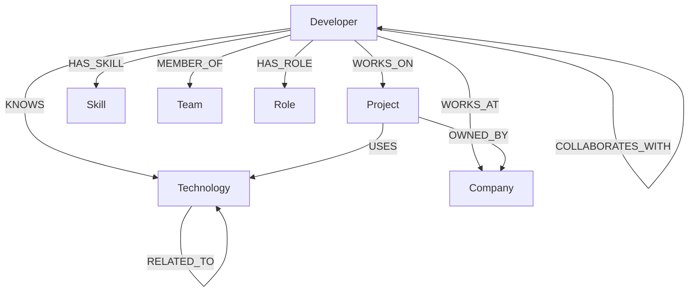

# Developer Knowledge Graph Explorer

A full-stack web application that demonstrates the power of graph databases for exploring interconnected developer ecosystems. Built as the Wexa AI Software Engineer take-home assignment.

## Project Overview

This application lets you explore relationships between **Developers**, **Projects**, **Technologies**, **Skills**, **Companies**, **Teams**, and **Roles** using **CognoDB** as the graph database backend.

Instead of stitching together many SQL joins, the app traverses relationships naturally — finding collaborators, discovering technologies through teammates, and visualizing multi-hop connections in a single query.

## Features

- **Dashboard** — Overview stats, most connected technologies, recent projects, and quick search
- **Developers** — Browse, filter, and inspect developer profiles with skills, projects, and technologies
- **Developer Detail** — Full profile with multi-hop traversal results and collaboration recommendations
- **Projects & Technologies** — Explore project tech stacks and technology adoption
- **Graph Explorer** — Interactive force-directed graph visualization with node expansion
- **Collaboration Explorer** — Find potential collaborators via shared technologies, projects, and teams
- **Global Search** — Search across developers, projects, technologies, and companies
- **Loading, Empty & Error States** — Polished UX throughout

## Why a Graph Database?

Relational databases struggle when relationships *are* the query. Consider finding collaborators for a developer:

```
Selected Developer → WORKS_ON → Project → USES → Technology ← KNOWS ← Other Developer
```

In SQL, this requires multiple JOINs across bridge tables, gets worse with each hop, and produces awkward queries for "explain why they're connected."

**CognoDB (via openCypher) excels because:**

| Capability | Graph DB Advantage |
|---|---|
| Multi-hop traversal | Follow relationships naturally without complex JOINs |
| Collaboration discovery | Match paths across shared nodes in one query |
| Connected technologies | Traverse `RELATED_TO` edges bidirectionally |
| Graph traversal | `shortestPath()` for collaboration chains |
| Relationship-heavy queries | Pattern matching in Cypher is declarative |
| Avoiding complex joins | No schema migration when adding relationship types |

The **Collaboration Explorer** and **Multi-Hop Traversal** features are deliberately designed to highlight queries that become painful in relational models.

## Architecture

```
React Frontend (Vite + Tailwind)
        ↓ REST API
Express.js Backend (Controllers → Services → DB)
        ↓ Bolt Protocol
Neo4j JavaScript Driver
        ↓
CognoDB (openCypher)
```

### Layer Separation

- **Controllers** — HTTP request/response handling
- **Services** — Business logic and Cypher query execution
- **Config/Database** — Singleton Neo4j driver with connection pooling
- **Frontend Services** — Centralized API client (`services/api.js`)

## Data Model



### Node Properties

| Label | Key Properties |
|---|---|
| Developer | id, name, email, experience, location |
| Project | id, name, description, status |
| Technology | id, name, category |
| Skill | id, name, level |
| Company | id, name, industry |
| Team | id, name |
| Role | id, title |

## Main Cypher Queries

All queries are **parameterized** (see `backend/queries/graphQueries.cypher`).

### Multi-Hop Traversal (Mandatory)

Finds technologies used by projects that a developer's teammates work on:

```cypher
MATCH (d:Developer {id: $id})-[:MEMBER_OF]->(team:Team)<-[:MEMBER_OF]-(teammate:Developer)
WHERE teammate.id <> d.id
MATCH (teammate)-[:WORKS_ON]->(p:Project)-[:USES]->(t:Technology)
WHERE NOT (d)-[:KNOWS]->(t)
RETURN DISTINCT t, teammate, p, team
```

### Collaboration Discovery (Relationally Awkward)

Finds developers connected through shared technologies, projects, or teams:

```cypher
MATCH (selected:Developer {id: $id})
OPTIONAL MATCH (selected)-[:KNOWS]->(sharedTech:Technology)<-[:KNOWS]-(candidate:Developer)
WHERE candidate.id <> selected.id
OPTIONAL MATCH (selected)-[:WORKS_ON]->(sharedProj:Project)<-[:WORKS_ON]-(candidate)
OPTIONAL MATCH (selected)-[:MEMBER_OF]->(sharedTeam:Team)<-[:MEMBER_OF]-(candidate)
RETURN candidate, sharedTechnologies, sharedProjects, sharedTeams, strength
```

### Shortest Collaboration Path

```cypher
MATCH (d1:Developer {id: $fromId}), (d2:Developer {id: $toId})
MATCH path = shortestPath((d1)-[:COLLABORATES_WITH*..6]-(d2))
RETURN path, length(path) AS hops
```

## Setup Instructions

### Prerequisites

1. **Node.js** 18+ ([nodejs.org](https://nodejs.org))
2. **CognoDB account** — [cognodb.com](https://cognodb.com)

### CognoDB Setup

1. Create a free CognoDB account
2. Create a new database instance
3. Copy the **Bolt URI** (e.g., `bolt+s://xxx.cognodb.com:7687`)
4. Save the **password** shown during creation

### Project Setup

```bash
# Clone the repository
git clone <your-repo-url>
cd wexa-graph-explorer

# Install all dependencies
npm run install:all

# Configure environment
cp .env.example backend/.env
# Edit backend/.env with your CognoDB credentials

# Seed the database
npm run seed

# Start both frontend and backend
npm run dev
```

## Environment Variables

| Variable | Location | Description |
|---|---|---|
| `COGNODB_URI` | `backend/.env` | Bolt connection URI from CognoDB dashboard |
| `COGNODB_USERNAME` | `backend/.env` | Database username (default: `cognodb`) |
| `COGNODB_PASSWORD` | `backend/.env` | Database password from CognoDB |
| `PORT` | `backend/.env` | Backend server port (default: `5000`) |
| `VITE_API_URL` | optional | Frontend API base URL (defaults to proxy) |

**Never commit `backend/.env` with real credentials.**

## Running Locally

```bash
# Install dependencies
npm run install:all

# Seed database (first time only)
npm run seed

# Run both servers concurrently
npm run dev

# Or run separately:
npm run server   # Backend on http://localhost:5000
npm run client   # Frontend on http://localhost:5173
```

### Verify

- Backend health: `http://localhost:5000/api/health`
- Frontend: `http://localhost:5173`

## API Endpoints

| Method | Endpoint | Description |
|---|---|---|
| GET | `/api/health` | Health check |
| GET | `/api/dashboard` | Dashboard data |
| GET | `/api/developers` | List all developers |
| GET | `/api/developers/:id` | Developer details |
| GET | `/api/developers/:id/network` | Multi-hop traversal |
| GET | `/api/technologies` | List technologies |
| GET | `/api/technologies/:id` | Technology details |
| GET | `/api/projects` | List projects |
| GET | `/api/projects/:id` | Project details |
| GET | `/api/search?q=` | Global search |
| GET | `/api/collaborators/:developerId` | Collaboration recommendations |
| GET | `/api/graph/:id` | Graph neighborhood for visualization |
| GET | `/api/collaboration-path?from=&to=` | Shortest collaboration path |

## Deployment

### Backend (Render / Railway / Fly.io)

1. Push code to GitHub
2. Create a new Web Service
3. Set root directory to `backend`
4. Build command: `npm install`
5. Start command: `npm start`
6. Add environment variables (`COGNODB_URI`, `COGNODB_USERNAME`, `COGNODB_PASSWORD`, `PORT`)

### Frontend (Vercel / Netlify)

1. Set root directory to `frontend`
2. Build command: `npm run build`
3. Output directory: `dist`
4. Set `VITE_API_URL` to your deployed backend URL

## Screenshots

> Replace these placeholders with actual screenshots after running the app.

| Dashboard | Graph Explorer |
|---|---|
|  |  |

| Developer Detail | Collaboration Explorer |
|---|---|
|  |  |

## Future Improvements

- Graph query builder UI for custom Cypher patterns
- Real-time graph updates via WebSocket
- Export graph visualizations as PNG/SVG
- Authentication and role-based access
- Pagination for large result sets
- Graph algorithm library (PageRank for influential technologies)
- Docker Compose for one-command local setup

## License

MIT
